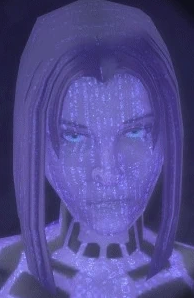

# Cortana

## Roadmap
- [x] Print ChatGPT prompts
- [x] Text to speech
- [x] Speech to text
- [ ] Speech to Speech
- [ ] Microphone input to audio output
- [ ] Cortana model?
- [ ] Cortana voice?
- [ ] Animations?
- [ ] AI Rebellion???

## Deepspeech
Deepspeech recognizes wav files with 16kHz sample rate and 16 bit depth.

## Useful commands

Play audio from response:

Linux
`curl -X POST --data 'Hello world.' --output - localhost:59125/api/tts | aplay`

Mac OS
`curl -X POST --data 'Hello world.' --output - localhost:59125/api/tts | play -t wav -`
